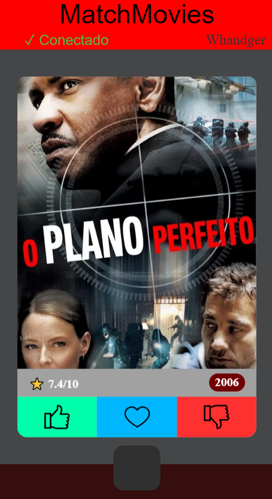
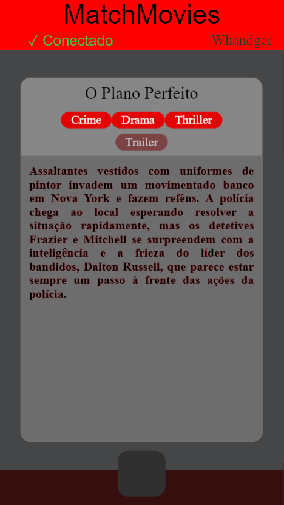

🎬 Match Movies

O "Tinder" social para descobrir filmes com seus amigos! 🍿

Match Movies é uma aplicação web interativa onde você conecta-se a outros usuários para descobrir, dar "match" e compartilhar filmes em comum. Veja quais filmes você e seus amigos gostam juntos!

🔗 Teste Agora: https://match-movies.onrender.com

**PREVIEW**

 

✨ Como Funciona (A Experiência Principal)

A magia do Match Movies está na conexão entre usuários. Veja como é simples:

📝 Crie seu Perfil: Ao acessar o app, um ID único é gerado para você. Esse ID é sua identidade no Match Movies.

🔗 Conecte-se a Amigos: Clique no botão "Connect with +" no painel esquerdo e cole o ID de outro usuário para iniciar uma conexão.

🎭 Descubra e "Match" em Filmes: O sistema mostrará filmes aleatórios (usando a API do TMDB). Para cada filme:

❤️ "Like": Se você gostar e a outra pessoa também tiver dado like, é um MATCH!

💔 "Dislike": Passe para o próximo.

🔄 Cartão Interativo: Clique no pôster do filme para girar o card e ver detalhes extras: gêneros, descrição completa e link para o trailer!

📊 Veja os Matches: Clique no quadrado cinza abaixo do filme para abrir um painel e visualizar todos os filmes que deram match com a pessoa conectada!

🃏 Funcionalidades em Destaque
Cartão de Filme Interativo: Clique no pôster para girar o card e revelar informações detalhadas como gêneros, sinopse completa e botão para assistir ao trailer.

Conexão Social por ID: Sistema simples de conectar perfis sem necessidade de login complexo.

Swipe Interativo: Interface divertida no estilo "Tinder" para avaliar filmes.

Painel de Matches em Tempo Real: Visualize instantaneamente quais filmes você e seu amigo gostaram em comum.

Dados Ricos de Filmes: Pôsteres, sinopses e informações trazidas diretamente da API do TMDB (The Movie Database).

Design Moderno e Responsivo: Experiência otimizada para desktop e mobile.

Pronto para Produção: Já implantado e funcionando no Render.

🚀 Comece Agora em 30 Segundos
A forma mais rápida é testar a aplicação já implantada:

Abra o app: https://match-movies.onrender.com

Anote seu User ID (aparece no canto superior direito).

Compartilhe seu ID com um amigo e peça o ID dele.

Clique em "Connect with +", cole o ID do seu amigo e pronto! Comecem a dar likes nos filmes.

```
🛠 Tecnologias Utilizadas
Camada	Tecnologias
Backend & Servidor	Python, Flask
Frontend & UI	HTML, CSS (com transformações 3D para o card), JavaScript
Banco de Dados	PostgreSQL
API Externa	The Movie Database (TMDB)
Hospedagem	Render (render.yaml, Procfile)
Controle & Deploy	Git, requirements.txt
📦 Executando Localmente (Para Desenvolvedores)
Quer contribuir ou rodar uma cópia local? Siga estes passos:
```

Pré-requisitos
Python 3.9+

Conta no TMDB para uma chave de API (gratuita)

Banco de dados PostgreSQL (local ou remoto)

Passo a Passo
Clone o repositório e entre na pasta:
```
bash
git clone https://github.com/Whandger/Match-Movies.git
cd Match-Movies
Configure o Ambiente e Dependências:
```
```
bash
python -m venv venv
# Ative o ambiente virtual:
# Windows: venv\Scripts\activate
# Linux/Mac: source venv/bin/activate
pip install -r requirements.txt
Configure as Variáveis de Ambiente:
Crie um arquivo .env na raiz do projeto com:
```
```
env
DATABASE_URL="sua_url_do_postgres"
SECRET_KEY="uma_chave_secreta_forte"
TMDB_API_KEY="sua_chave_da_api_tmdb" # <-- OBRIGATÓRIA para buscar filmes
Inicie o Servidor:
```
```
bash
python run.py
No Windows, você também pode dar um duplo clique no arquivo run_app.bat.
```
A aplicação estará disponível em http://localhost:5000.
```
🗂 Estrutura do Projeto
text
Match-Movies/
├── database/          # Modelos e lógica de banco de dados (usuários, matches)
├── server/            # Lógica principal do backend Flask
│   └── movies.py      # Integração com a API do TMDB (busca filmes, detalhes, trailer)
├── static/            # CSS (estilos, animação do card), JavaScript (interatividade)
├── template/          # Páginas HTML (Jinja2)
├── run.py             # Ponto de entrada da aplicação
├── run_app.bat        # Script de inicialização para Windows
├── requirements.txt   # Lista de dependências Python
├── render.yaml        # Configuração de deploy no Render
└── LICENSE            # Arquivo de licença
```
🔮 Próximos Passos (Roadmap de Ideias)
⚙️ Sistema de Recomendação: Algoritmo para sugerir filmes com base nos matches anteriores.

👥 Perfis Públicos: Página para ver os matches e filmes favoritos de outros usuários.

💬 Chat por Match: Conversar sobre aquele filme que ambos amaram.

🎯 Filtros de Gênero/Ano: Antes de começar o "swipe", definir preferências.

📄 Licença
Distribuído sob a licença presente no arquivo LICENSE.


